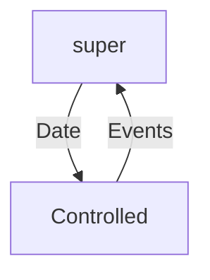

# React

## Javascript

### this keyword

Arrow funfions 不会改变this的值

```javascript
const person = {
  walk() = {
    console.log(this);
  }
};

// output person
person.walk();

// output window object
const walk = person.walk;
walk();

// bind this
// output person
const walk = person.walk.bind(person);  // return a new function
walk();
```

### Object Destructing

```javascript
const address = {
  street,
  city,
  country
};  

const { street: st, city, country } = address;
```

### Spread Operator

```javascript
const first = [1, 2, 3];
const second = [4, 5, 6];

const combined = [...first, ...second];
```

## Components

`./components/counter.jsx`

```jsx
import React, { Component } from 'react';

class Counter extends Component {
    render() {
        return (<h1>Hello World</h1>);
    }
}

export default Counter;
```

`./index.js`

```jsx
import Counter from './components/counter';

ReactDOM.render(
  <React.StrictMode>
    <Counter />
  </React.StrictMode>,
  document.getElementById('root')
);
```

### 标签的属性

#### className

```jsx
<span className={this.getBtnClasses()}>{this.state.counter}</span>

getBtnClasses() {
  let classes = "badge m-2 badge-";
  if (this.state.count === 0) {
    classes += "warning";
  } else {
    classes += "primary";
}
```

#### Style

要传入一个js对象

```react
style = {
  fontSize: 30
}

<span style={this.style}>1</span>

```

### 渲染列表

```jsx
state = {
  count: 0,
  tags: ["tag1", "tag2", "tag3"],
};

<ul>
    {this.state.tags.map((tag) => (
      <li key={tag}>{tag}</li> // key 只需要在list里面唯一
    ))}
</ul>
```

#### 条件晕染

* Method 1: 函数
* Method 2: &&

``` javascript
true && "string"		// return "string"
true && "string" && 1		// return 1
```

### 事件处理

#### 绑定this

Method 1:

``` javascript
class Counter extends Component {
  constructor() {
    super();
    this.handleIncresment = this.handleIncresment.bind(this);
  }
  
  handleIncresment() {
    ...
  }
}
```

Method 2: 箭头函数不会重新绑定this

``` javascript
handleIncresment = () => {
    ...
}
```

#### Upate State

react不会自动侦测改动

要调用`setState()`方法

```jsx
handleIncresment() {
    this.setState({ count: this.state.count + 1 });
}
```

在调用`setState()`后，react会计划一次render

#### 传参

```jsx
handleIncrement = product => {
  ...
};
  
<button onClick={() => { this.handleIncrement(someProduct) }}></button>
```

#### 向组件中传参

```jsx
<Counter value={this.state.value}/>
```

会传递给`props`对象

#### state vs props

* state是组件私有的
* props是只读的，要修改props要先复制到state

#### 事件传递

`counters.jsx`: 

```jsx
import React, { Component } from "react";
import Counter from "./counter";

class Counters extends Component {
  state = {
    counters: [
      { id: 0, value: 4 },
      { id: 1, value: 0 },
      { id: 2, value: 0 },
      { id: 3, value: 0 },
    ],
  };

	// 把handleDelete的引用传入Counter的onDelete
  handleDelete = (id) => {
    this.setState({ counters: this.state.counters.filter((c) => c.id !== id) });
  };

  render() {
    return (
      <div>
        {this.state.counters.map((c) => (
          <Counter
            key={c.id}
            id={c.id}
            value={c.value}
            onDelete={(id) => {
              this.handleDelete(id);
            }}
          />
        ))}
      </div>
    );
  }
}

export default Counters;
```

`counter.jsx`

```jsx
import React, { Component } from "react";

class Counter extends Component {
  state = {
    value: this.props.value,
  };

  handleIncrement = () => {
    this.setState({ value: this.state.value + 1 });
  };

  getValue = () => {
    if (this.state.value === 0) return "zero";
    else return this.state.value;
  };

  getClass = () => {
    let classes = "m-2 badge badge-";
    return (classes += this.state.value === 0 ? "warning" : "primary");
  };

  render() {
    return (
      <div>
        <span className={this.getClass()}>{this.getValue()}</span>
        <button
          onClick={this.handleIncrement}
          className="btn btn-secondary btn-sm"
        >
          Increment
        </button>
        
        <!-- OnDelete 事件 -->
        <button
          className="btn btn-danger btn-sm m-2"
          onClick={() => this.props.onDelete(this.props.id)}
        >
          Delete
        </button>
      </div>
    );
  }
}

export default Counter;
```

### Single Source of Truth

#### Controlled Component



#### Stateless Functional Components

Short cut: `sfc`

```jsx
import React, { Component } from "react";

const NavBar = (props) => {
  return (
    <nav className="navbar navbar-light bg-light">
      <a className="navbar-brand" href="#">
        Navbar{" "}
        <span className="badge badge-pill badge-secondary">
          {props.totalCounters}
        </span>
      </a>
    </nav>
  );
};

export default NavBar;
```

props作为参数传入

### Liftcycle hooks

1. Mount
   1. constructor
   2. render
   3. componentDidMount
2. Update
   1. render
   2. componentDidMount
3. Unmount
   1. componentWillUnmount

### 类型检测

```shell
npm i prop-types
```


``` jsx
import PropTypes from "prop-types";
```

### defaultProps
``` jsx
ListGroup.defaultProps = {
	textProperty: "name",
	valueProperty: "_id"
}
```

## Routing

``` shell
npm i react-router-dom
```

```jsx
import { BrowserRouter } from "react-router-app";


...

<BrowserRouter>
	<App />
</BrowserRouter>

...
```


在`path`匹配的时候component会显示出来，如果有`exact`

```jsx
class App extends Component {
  render() {
    return (
      <div>
        <NavBar />
        <div className="content">
          <Route path="/products" component={Products} />
          <Route path="/posts" component={Posts} />
          <Route path="/admin" component={Dashboard} />
          <Route path="/" exact component={Home} />
        </div>
      </div>
    );
  }
}

export default App;
```

或者用`Switch`, `Swirch`只匹配第一个

```react
<Switch>
    <Route path="/products" render={props => <Propducts sortBy="..." {...props} />} />
    <Route path="/posts" component={Posts} />
    <Route path="/admin" component={Dashboard} />
    <Route path="/" component={Home} />
</Switch>
```

用`<Link to="">`代替`<a href="">`可以避免每次切换都发HTTP请求


### 路由参数

Route会向component传入3个props: 

* history
* location
* match

要传入其他参数需要render

```react
<Route path="/products" reder={props => <Products sortBy="name" {...props}/>} />
```


```react
<Route path="/products/:id" component={ProductDetails} />
```

参数在`match.params`中

* optional: `:id?`

### Query String

`location.search`

```shell
npm i query-string
```

### Redirection

如果用户输入messages，重定向到posts

```react
<Redirect from="/messages" to="posts"/>
```

### Programmatic Navigation

```react
this.props.history.push("/products");
```

### Nesting Router

## Ch7 Form

### 关联`label`和`input`

*   在html里是`for`，在react里是`htmlFor`

```react
<form>
    <label htmlFor="exampleInput">Label</label>
    <input type="email" id="exampleInput" />
</form>
```

<form>
    <label for="exampleInput">Label</label>
    <input type="email" id="exampleInput" />
</form>

### 表单提交行为

```react
handleSubmit = e => {
  e.preventDefault();  
    
    
};

// in render
<form onSubmit={this.handleSubmit}></form>
```

### Refs

==在React中不应该直接使用`document`对象。==
